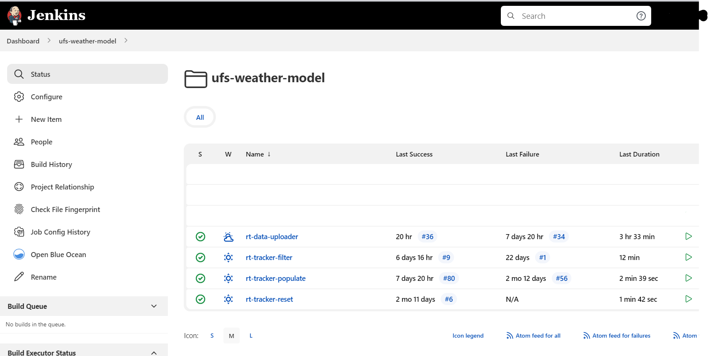
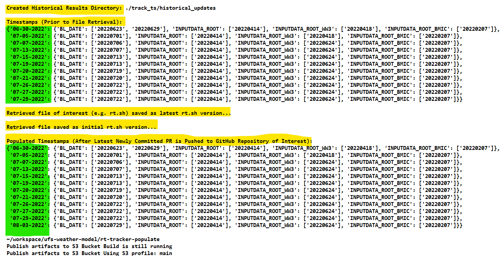
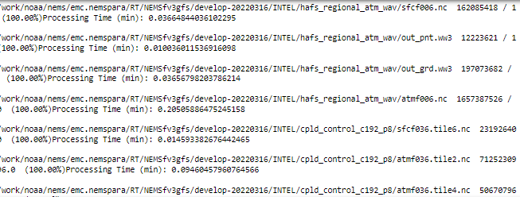
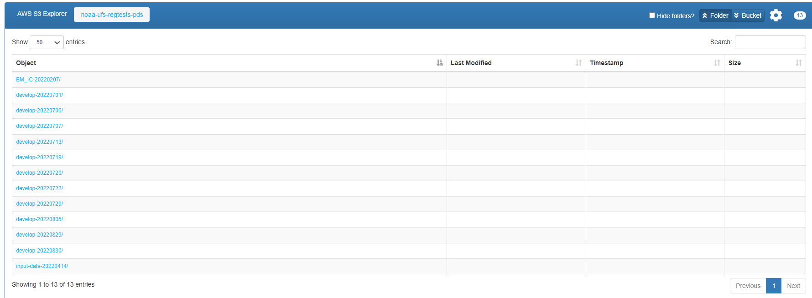
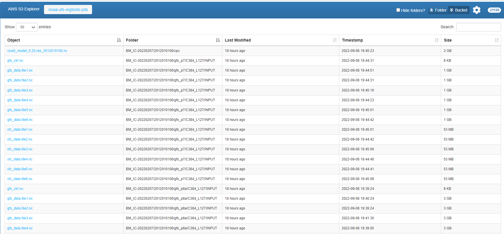

<h1 align="center">
UFS Data Tracking & Maintenance Bot:
</h1>

<h2 align="center">    
A Robotic Process Automation (RPA) Application for UFS-WM Data Detection, Tracking, Cloud Migration, & Maintenance
</h2>

    
    
    
    
    

<h5 align="center">
    
[Prerequisites](#Prerequisites) • [Dataset](#Dataset) • [Quick Start](#Quick-Start)  • [Environment Setup](#Environment-Setup) • [Status](#Status)
 • [What's Included](#What's-Included) • [Documentation](#Documentation) • [References](#Reference(s))

</h5>

# About

__Introduction:__

Currently, the NOAA development teams' code managers are maintaining their datasets manually via checking if a UFS-WM timestamped dataset has been revised, committed and pushed to the UFS-WM development branch repository on a regular basis. In addition, the code managers would occasionally perform frequent data cleaning -- in an effort to maintain the UFS-WM datasets that can only support the latest two-months of development UFS-WM code. On occassion, there were cases found for when UFS timestamped datasets were unused and allocating on-prem disk space -- that is, datasets that were supporting UFS-WM code beyond the data maintenance requirement of retaining only the latest two-months of development UFS-WM code window. The manual labor to track the UFS-WM timestamp datasets and their respective revisions as well as data cleaning performed by code managers is known to lead to mishaps in data tracking and maintenance for the UFS-WM.

As a result, as EPIC continues to work in parallel with the NOAA development teams' UFS-WM code development, the development of a Robotic Process Automation (RPA) application will support the automation of data tracking, migration, and maintenance of the UFS-WM's datasets to cloud as revision are continuously made against the UFS timestamped datasets by developers. The RPA will be referred as the UFS Data Tracking & Maintenance Bot application. The UFS-WM Data Tracking & Maintenance Bot application will be able to automatically track the dataset revisions made to the developing UFS-WM, upload the newly pushed UFS-WM datasets to the cloud storage reserved for the UFS-WM framework (Refer to AWS S3 cloud storage location: https://noaa-ufs-regtests-pds.s3.amazonaws.com/index.html), and retain the code managers traditional maintenance in data cleaning in cloud.

__Purpose:__

The purpose of the UFS-WM Data Tracking & Maintenance Bot is for UFS data detection, tracking, cloud migration, and cloud data maintenance of the UFS-WM timestamped datasets made to the UFS-WM developemnt branch. The application will be able to track the UFS-WM input and baseline dataset revisions of the UFS-WM development code and in response, will migrate each revised dataset to cloud data storage via chaining API calls to communicate with cloud data storage buckets. The application will record the date at which the dataset revisions were pushed out to the UFS-WM dev. code and generate a log ("nested dictionary") for historical reference and usage to perform the data maintenance. Integrated with the data mainentance script, the application will have the capability to retain the datasets supporting the latest 2-months of UFS-WM development code via its feature of a shifting window filter (e.g. 2-month window of retrieved revised datasets from UFS-WM dev. code) -- ultimately, fulfilling the existing data maintenance requirement. 

The following tools could be be utilized to perform data transferring & partitioning (Multipart Upload/Download) are:

* AWS SDK
* AWS CLI
* AWS S3 REST API

All of these AWS provided tools are built on top of Boto3.

In this demonstration, the framework will implement Python AWS SDK for transferring the tracked UFS datasets from the RDHPCS, Orion, to the cloud data storage with the capability of reducing latency via tuning the boto3 parameters.

The AWS SDK will be implemented for the following reasons:
* AWS SDK carries addition capabilities/features for data manipulation & transferring compare to the aforementioned alternate tools
* All for easy code integration with other python scripts.
* Will leverage any APIs and all the development tools to develop a standardized application.

According to Amazon's AWS, the following conditions must be met when transferring data to cloud data storage:

* Largest object that can be uploaded in a single PUT is 5 GB.
* Individual Amazon S3 objects can range in size from a minimum of 0 bytes to a maximum of 5 TB.
* For objects larger than 100 MB, Amazon recommends using the Multipart Upload capability.
* The total volume of data in a cloud data storage bucket are unlimited.

__Capabilities:__

This RPA application will be able to perform the following actions:

* Client makes a direct request for rt.sh from GitHub.
* Extract and parse relevant information from file of interest. The file of interest (rt.sh) is read, preprocessed & extracted -- the timestamps of the latest merged UFS datasets on GitHub is recorded.
* Generates a historical log file containing the merged datasets' timestamps
* Program will compare the historical log file with the most recent historical file containing the datasets' timestamps and update the latest historical log file.
* Latest datasets merged to UFS-WM is synced and migrated to S3 cloud. 
* Multi-threading & partitioning to the datasets to assist in the optimization in uploading performance of the datasets from on-prem to cloud as it tracks the PR'd timestamped dataset updates pushed by developers & approved by code manager(s) of the UFS-WM.
* Running weekly, the application will retain the datasets in cloud for which supports the latest 2-months of UFS-WM development code. Performed by an integrated data maintenance script, which will perform the 2 months window shift of datasets to maintain the NOAA development teams' code managers current practice and fulfill the stored data requirements.

__Future Capabilities:__

This RPA application will allow:

* Automation -- time and efficiency.
* Assist in the new CM transitioning for the UFS-WM repo via preserving the traditional maintenance performed by legacy teams until further plans are made in improving the way the UFS-WM is being handled by new team.
* Reduces human error that can be resolved by the application as much as possible given the current UFS-WM structure/process.

# Table of Contents

* [Prerequisites](#Prerequisites)
* [Dataset](#Dataset)
* [Quick Start](#Quick-Start)
* [Environment Setup](#Environment-Setup) 
* [Status](#Status)
* [What's Included](#What's-Included)
* [Documentation](#Documentation)
* [References](#Reference(s))

# Prerequisites

* Python 3.9
* Setting up AWS CLI configurations for uploading to Cloud.
* Setting up conda environment w/in RDHPCS.
    * Refer to [Environment Setup](#Environment-Setup)

# Dataset

* Currently, data resides on RDHPCS. 

# Quick Start

* For demonstration purposes, refer to 'rt_revision_tracker_scripts_demo.ipynb'

# Environment Setup:

* Install miniconda on your machine. Note: Miniconda is a smaller version of Anaconda that only includes conda along with a small set of necessary and useful packages. With Miniconda, you can install only what you need, without all the extra packages that Anaconda comes packaged with:
Download latest Miniconda (e.g. 3.9 version):

    * wget https://repo.anaconda.com/miniconda/Miniconda3-py39_4.9.2-Linux-x86_64.sh

* Check integrity downloaded file with SHA-256:

    * sha256sum Miniconda3-py39_4.9.2-Linux-x86_64.sh

Reference SHA256 hash in following link: https://docs.conda.io/en/latest/miniconda.html

* Install Miniconda in Linux:

    * bash Miniconda3-py39_4.9.2-Linux-x86_64.sh

* Next, Miniconda installer will prompt where do you want to install Miniconda. Press ENTER to accept the default install location i.e. your $HOME directory. If you don't want to install in the default location, press CTRL+C to cancel the installation or mention an alternate installation directory. If you've chosen the default location, the installer will display “PREFIX=/var/home//miniconda3” and continue the installation.

* For installation to take into effect, run the following command:

source ~/.bashrc

* Next, you will see the prefix (base) in front of your terminal/shell prompt. Indicating the conda's base environment is activated.

* Once you have conda installed on your machine, perform the following to create a conda environment:

    * To create a new environment (if a YAML file is not provided)

        * conda create -n [Name of your conda environment you wish to create]

(OR)

    * To ensure you are running Python 3.9:

        * conda create -n myenv Python=3.9

(OR)

* To create a new environment from an existing YAML file (if a YAML file is provided):

    * conda env create -f environment.yml

*Note: A .yml file is a text file that contains a list of dependencies, which channels a list for installing dependencies for the given conda environment. For the code to utilize the dependencies, you will need to be in the directory where the environment.yml file lives.

### Activate the new environment via:

conda activate [Name of your conda environment you wish to activate]

* Verify that the new environment was installed correctly via:

    * conda info --env

*Note:

* From this point on, must activate conda environment prior to .py script(s) or jupyter notebooks execution using the following command: conda activate
    * To deactivate a conda environment:
        * conda deactivate

### Link Home Directory to Dataset Location on RDHPCS Platform

* Unfortunately, there is no way to navigate to the "/work/" filesystem from within the Jupyter interface when working on the remote server, Orion. The best way to workaround is to create a symbolic link in your home folder that will take you to the /work/ filesystem. Run the following command from a linux terminal on Orion to create the link:

    * ln -s /work /home/[Your user account name]/work

* Now, when you navigate to the /home/[Your user account name]/work directory in Jupyter, it will take you to the /work folder. Allowing you to obtain any data residing within the /work filesystem that you have permission to access from Jupyter. This same procedure will work for any filesystem available from the root directory.

*Note: On Orion, user must sym link from their home directory to the main directory containing the datasets of interest.

### Open & Run Data Analytics Tool on Jupyter Notebook

* Open OnDemand has a built-in file explorer and file transfer application available directly from its dashboard via ...

Login to https://orion-ood.hpc.msstate.edu/

* In the Open OnDemand Interface, select Interactive Apps > Jupyter Notbook

### Additonal Information

To create a .yml file, execute the following commands:

* Activate the environment to export:

    * conda activate myenv

* Export your active environment to a new file:

    * conda env export > [ENVIRONMENT FILENAME].yml

# Status

# What's Included
Within the download, you will find the following directories and files:
  
* Tracker Scripts:
    > rt_revision_tracker.py
    > rt_tracker_populate.py
    > rt_tracker_reset.py

* Transfer Scripts:
    > upload_data.py
        * Uploader via AWS SDK
    > transfer_specific_data.py 
        * Executable script for specific dataset to transfer to cloud
    > transfer_bot_data.py  
        * Executable script for datasets recorded by UFS data tracker bot to transfer to cloud
    > get_timestamp_data.py
        * Dataset reader from UFS data's source
    > progress_bar.py
        * Monitors uploading progress of datasets to cloud      

* Maintenance ("Filter") Script:
    > rt_tracker_filter.py
        * Prior to executing the maintenance script, it is important to ensure the log that it reads from the log (generated by rt_tracker_populate.py) contains at least 60 days worth of recorded data -- that is, there must be at least N days (e.g. 60 days) of retrieval dates that are within the latest 60-day window from the time the maintence script has been executed. 
        
* Tracker Demo:
    > rt_revision_tracker_scripts_demo.ipynb

* Transfer Demo:
    > data_xfer2cloud_scripts_demo.ipynb

* Data Maintenance ("Filter") Demo:
    > rt_data_tracker&maintenance_scripts_demo.ipynb
    
* List of Dependencies: 
    * git_env.yml (For Tracker Scripts)
    * cloud_xfer_env.yml (For Transfer Scripts)
    * cloud_maintenance_env.yml (For Maintenance ("Filter") Script)

# Documentation
* Refer to rt_revision_tracker_scripts_demo.ipynb
* Refer to data_xfer2cloud_scripts_demo.ipynb

# References
* N/A

# Version:
* Draft as of 07/12/22
